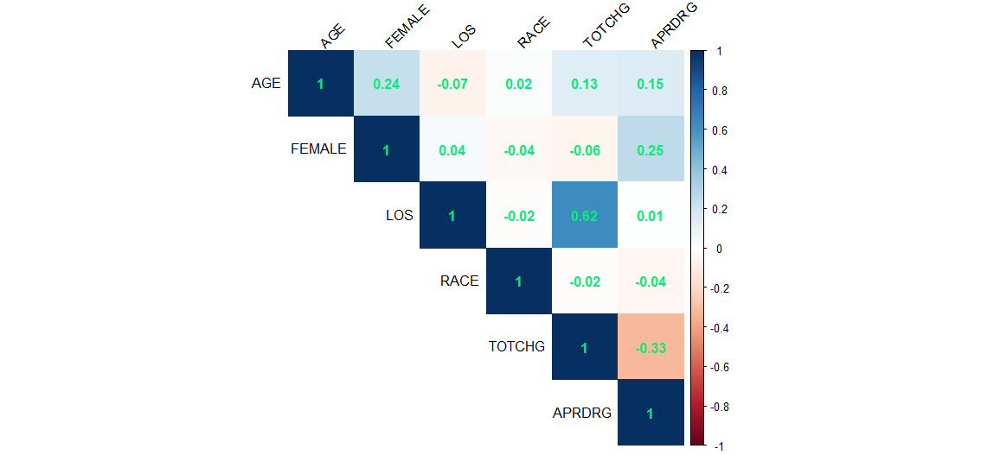
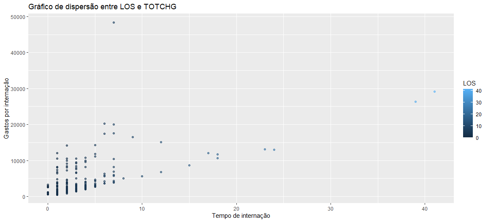

# 🔗 Correlação e Impacto de Variáveis

O tempo de permanência (*Length of Stay*) é um fator crucial para pacientes internados. Esta seção investiga a relação entre tempo, idade, gênero e raça.

---

## 📈 Correlação de Pearson

Calculamos as correlações entre todas as variáveis numéricas do dataset para identificar padrões ocultos.

=== "🕒 Tempo de Permanência (LOS)"
    A correlação entre o tempo de permanência (LOS) e as variáveis Idade (AGE), Gênero (FEMALE) e Raça (RACE) é **quase nula** (abaixo de 0,10). Isso indica que, estatisticamente, o tempo de permanência não está fortemente associado a esses atributos demográficos na amostra analisada.

=== "💵 Custos de Internação (TOTCHG)"
    Ao analisarmos a correlação entre todas as variáveis e o custo total da internação (TOTCHG), o resultado aponta que o **tempo de permanência (LOS)** é o fator que mais impacta nos custos hospitalares, apresentando uma correlação positiva de **0,62**.

---

## 📊 Dispersão: Tempo vs Custo

O gráfico de dispersão abaixo ilustra claramente a tendência de crescimento do custo total conforme o tempo de internação aumenta.

> **Insight Final:** O hospital deve focar na gestão eficiente do tempo de permanência dos pacientes como a principal alavanca para redução de custos, independentemente da idade ou gênero do paciente.
