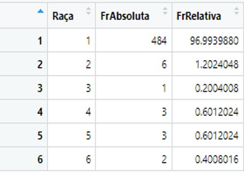
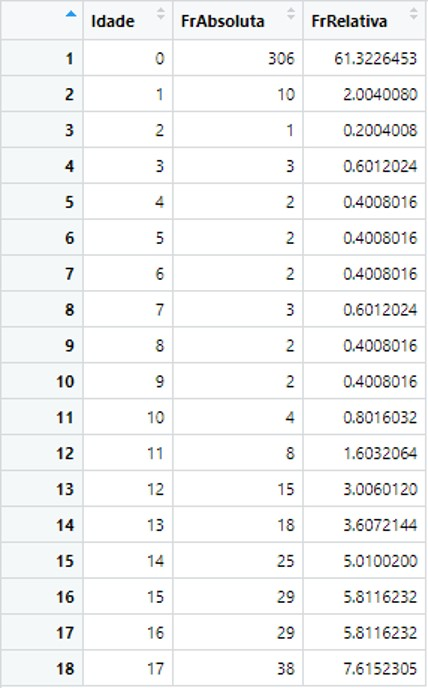

# 📈 Medidas de Dispersão e Frequência

As **Medidas de Dispersão** (ou variabilidade) mostram o quanto os dados estão afastados da média.

---

## 🌊 Medidas de Dispersão

=== "📏 Variância e Desvio Padrão"
    Mostram o comportamento dos dados em relação à média.
    
    *   **Qual a medida de dispersão da idade dos pacientes?**
        - R: Desvio Padrão de 6,95 anos.
    *   **Qual a medida de dispersão do tempo de internação?**
        - R: Desvio Padrão de 3,36 dias.

=== "📉 Coeficiente de Variação (CV)"
    O CV mede a relação entre o desvio padrão e a média.
    
    *   **CV da Idade:** 136,54% (Alta variabilidade).
    *   **CV do Tempo de Permanência:** 118,88% (Alta variabilidade).

---

## 📊 Tabelas de Frequência

As Tabelas de Frequência agrupam dados para uma visão macro da distribuição.

### 👥 Distribuição Racial (RACE)

| Raça | Frequência Absoluta | Frequência Relativa (%) |
| :--- | :--- | :--- |
| 1 | 484 | 97.00% |
| 2 | 6 | 1.20% |
| 3 | 1 | 0.20% |
| 4 | 3 | 0.60% |
| 5 | 3 | 0.60% |
| 6 | 2 | 0.40% |

> **Insight:** A grande maioria dos pacientes (97%) pertence ao identificador racial 1.

### 👶 Distribuição por Idade (AGE)

| Idade | Frequência Absoluta | Frequência Relativa (%) |
| :--- | :--- | :--- |
| 0 | 307 | 61.40% |
| 1 | 10 | 2.00% |
| 2 | 1 | 0.20% |
| 3 | 3 | 0.60% |
| 4 | 2 | 0.40% |
| 5 | 2 | 0.40% |
| 6 | 2 | 0.40% |
| 7 | 3 | 0.60% |
| 8 | 2 | 0.40% |
| 9 | 1 | 0.20% |
| 10 | 4 | 0.80% |
| 11 | 9 | 1.80% |
| 12 | 15 | 3.00% |
| 13 | 18 | 3.60% |
| 14 | 27 | 5.40% |
| 15 | 29 | 5.80% |
| 16 | 32 | 6.40% |
| 17 | 33 | 6.60% |

> **Insight:** Observamos um volume altíssimo de recém-nascidos (61.4%), seguido de um aumento gradual na faixa dos 12 aos 17 anos (adolescentes).
