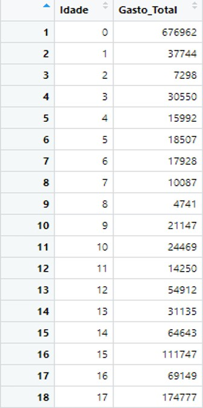
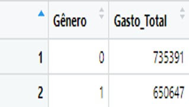
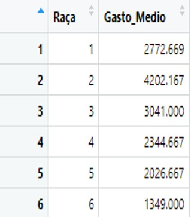
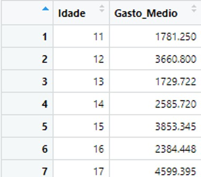
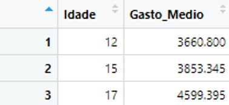

# 🏥 Insights de Negócio: Custos Hospitalares

A análise estratégica de custos hospitalares cruza dados demográficos com financeiros para identificar oportunidades de otimização de recursos.

---

## 💵 Gasto Total por Idade (AGE)

O gráfico abaixo mostra o custo total acumulado de todas as internações para cada idade na amostra.

*   **Qual o gasto total com internações hospitalares por idade?**
    - R: Somatório detalhado no gráfico.
*   **Qual idade gera o maior gasto total?**
    - R: **0 anos** (Recém-nascidos), com um gasto acumulado de **678.118,00 dólares**.

---

## ⚧ Gasto por Gênero (FEMALE)

*   **Qual o gasto total com internações hospitalares por gêneros?**
    - R: Masculino **681.045,00 dólares** vs Feminino **674.582,00 dólares**.

> **Insight:** Embora as frequências sejam próximas, pacientes do gênero **Masculino** geram um custo total ligeiramente superior na amostra analisada.

---

## 👥 Gasto Médio por Raça (RACE)

*   **Qual o gasto médio com internações hospitalares por raça do paciente?**
    - R: A raça **1** possui um gasto médio de **2.710,48 dólares**. A raça **6** possui o gasto médio mais elevado: **3.640,00 dólares**.

---

## 📉 Filtros Estratégicos (Análise > 10 Anos)

*   **Para pacientes acima de 10 anos, qual a média de gastos total?**
    - R: **2.977,29 dólares**.
*   **Qual idade (acima de 10 anos) tem média de gastos superior a 3000?**
    - R: As idades de **12 e 17 anos**.

