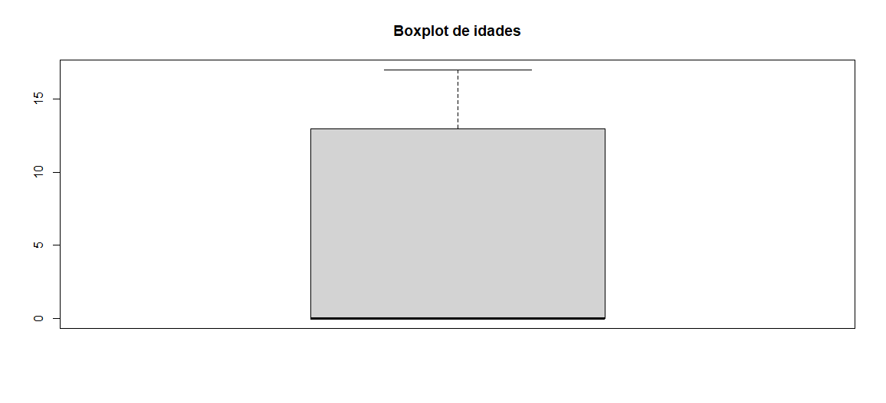
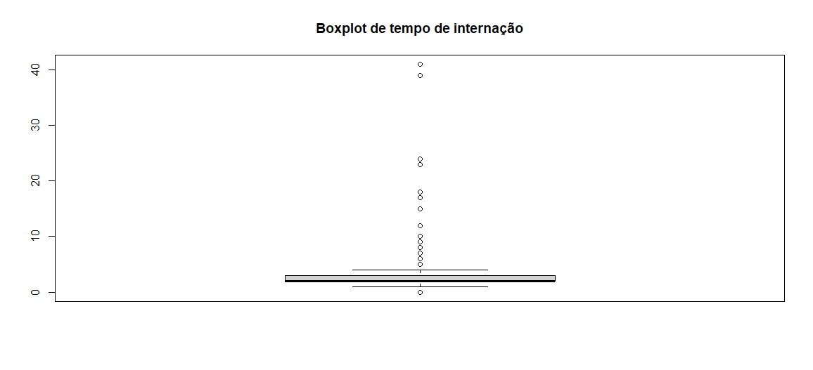

# 📉 Medidas de Tendência Central e Posição Relativa

A Análise Descritiva é responsável pela coleta, organização, descrição, síntese e análise dos dados. Ela pode ser feita através de **MEDIDAS DE TENDÊNCIA CENTRAL**, de **POSIÇÃO RELATIVA**, de **DISPERSÃO**, além de **TABELAS DE FREQUÊNCIA** e **REGRESSÃO**.

---

## 🏗️ Medidas de Tendência Central

São aquelas que mostram o comportamento dos dados em torno de uma medida de centro: **média**, **moda** e **mediana**.

=== "📊 Média"
    A média é a mais utilizada das medidas de tendência central, resultado da soma dos valores dividida pela quantidade de observações.
    
    *   **Qual a idade média dos pacientes?**
        - R: 5,09 anos
    *   **Qual o tempo médio de permanência das internações?**
        - R: 2,82 dias

=== "🎯 Moda"
    É o valor que se repete mais vezes dentre os dados observados.
    
    *   **Qual é a moda da idade dos pacientes?**
        - R: 0 anos (Recém-nascidos)
    *   **Qual é a moda de permanência das internações?**
        - R: 2 dias

=== "⚖️ Mediana"
    É o valor central do conjunto de dados, organizado de forma crescente ou decrescente.
    
    *   **Qual a mediana da idade dos pacientes?**
        - R: 0 anos
    *   **Qual a mediana do tempo de permanência?**
        - R: 2 dias

---

## 📍 Medidas de Posição Relativa

Comparam a posição de um valor em relação a outro em um conjunto de dados. **Percentis** e **quartis** são os mais comuns.

*   **Percentis:** Dividem o conjunto de dados em 100 partes iguais.
*   **Quartis:** Dividem o conjunto de dados em 4 partes iguais (25%, 50%, 75%, 100%).

### 🧩 Resumo Estatístico das Idades

| Min. | 1st Qu. | Median | Mean | 3rd Qu. | Max. |
| :--- | :--- | :--- | :--- | :--- | :--- |
| 0.00 | 0.00 | 0.00 | 5.09 | 13.00 | 17.00 |

> **Insight:** Analisando o boxplot, concluímos que pelo menos 50% dos dados de idade estão na faixa de 0 anos (recém-nascidos).

### 🕒 Resumo Estatístico do Tempo de Permanência (LOS)

| Min. | 1st Qu. | Median | Mean | 3rd Qu. | Max. |
| :--- | :--- | :--- | :--- | :--- | :--- |
| 0.00 | 2.00 | 2.00 | 2.83 | 3.00 | 41.00 |

> **Insight:** 25% dos dados concentram-se em 2 horas de permanência. Observamos muitos **outliers** (pacientes que ficam muito mais tempo que a média).
