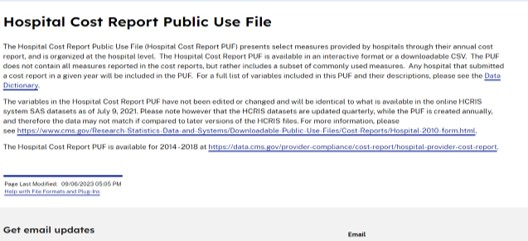

  <!-- Hero Section -->
  <section class="hero">
    

      <h1 class="hero-title">
        CustosHospitalares
      </h1>
      

        Análise Descritiva e Estratégica utilizando R e SQL para otimização de tomada de decisão em saúde.
      

      

        <a href="sobre/" class="btn btn-primary">Iniciar Análise</a>
        <a href="https://www.youtube.com/watch?v=Zf6rcv67bT4" target="_blank" class="btn btn-secondary">Assistir Vídeo</a>
      

    

    

      

        
      

    

  </section>

  <!-- O PROJETO Section -->
  <section class="info-section">
    A ABORDAGEM
    

      

        <h3>📊 Estatística Profunda</h3>
        
Medidas de tendência central, posição e dispersão para entender o comportamento dos custos.

      

      

        <h3>💻 R & SQL Híbrido</h3>
        
Uso de R para visualização e `sqldf` para manipulação de dados com agilidade.

      

      

        <h3>🏥 Foco em Healthcare</h3>
        
Análise de internações pediátricas (0-17 anos) com base em dados reais da agência US Agency for Healthcare.

      

    

  </section>

  <!-- O MÉTODO Section -->
  <section class="info-section">
    O MÉTODO
    

      

        <h3>🧩 20 Perguntas de Negócio</h3>
        
Respostas diretas a questões estratégicas que impactam a operação e o financeiro hospitalar.

      

      

        <h3>📈 Visualizações Limpas</h3>
        
Uso de ggplot2 e corrplot para transformar dados complexos em insights visuais claros.

      

      

        <h3>🔗 Correlação & Custo</h3>
        
Identificação das variáveis (idade, gênero, tempo de permanência) que mais impactam no custo total.

      

    

  </section>

